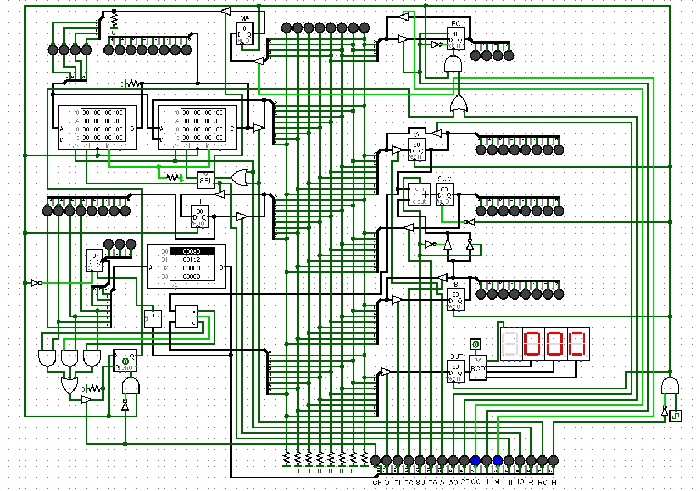

# 8-bit-computer

This is an 8-bit computer based on the [videos](https://www.youtube.com/watch?v=HyznrdDSSGM&list=PLowKtXNTBypGqImE405J2565dvjafglHU) of Ben Eater in Logisim. The programs provided can be loaded into the RAM modules on the the top left side.

Download Logisim [here](http://www.cburch.com/logisim/)
